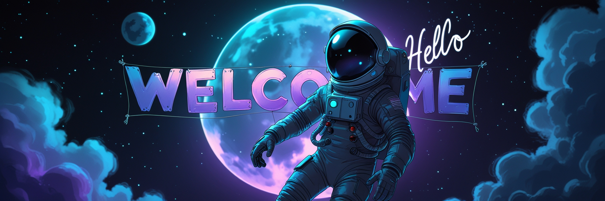

ʜɪ! ɪ'ᴍ ᴊᴏʜɴ 👋

  

  <picture>
    <source media="(prefers-color-scheme: dark)" srcset="https://raw.githubusercontent.com/JohnMalvin/JohnMalvin/output/github-snake-dark.svg" />
    <source media="(prefers-color-scheme: light)" srcset="https://raw.githubusercontent.com/JohnMalvin/JohnMalvin/output/github-snake.svg" />
    
  </picture>

  
ᴄᴜʀʀᴇɴᴛʟʏ ᴡᴏʀᴋɪɴɢ ᴏɴ:

  <header style="border: 0px">
    

      

        
      

      
 ᴀɴᴅ 

      

        
      

    

  </header>

  <!-- 
ʟᴀᴛᴇꜱᴛ ᴘʀᴏᴊᴇᴄᴛ:
 
   -->

 
  
 

## ⚙️ Gears

  
  
  
  
  
  
  
  
  
  
  
  
  

##### Design Software:
 
 
 
 
 
 
 

##### Currently Learning:
 
 
 
 
 

## 🏆 GitHub Trophies

  

